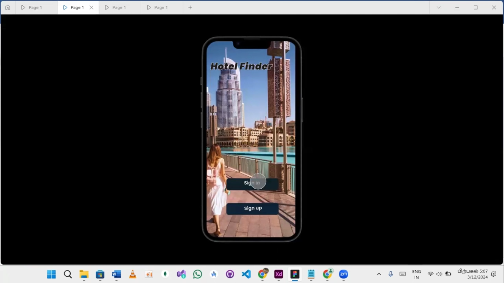

<!DOCTYPE html>
<html lang="en">
<head>
  <meta charset="UTF-8">
  <meta name="viewport" content="width=device-width, initial-scale=1.0">
  
</head>
<body>

  <header>
    <h1>HCI Prototyping Design Tools</h1>
    
A Deep Dive into the Top Tools for Effective Prototyping

  </header>

  <section>
    <h2>Overview</h2>
    
There are three main developer tools used in HCI prototyping design:

    <ul>
      <li><strong>Marvel</strong>: A user-friendly, web-based tool for rapid prototyping, user testing, and simple design collaboration.</li>
      <li><strong>Adobe XD</strong>: A vector-based design and prototyping tool for creating interactive UI/UX experiences with advanced animation and collaboration features.</li>
      <li><strong>Figma</strong>: A cloud-based design and prototyping tool that enables real-time collaboration, version control, and scalable design systems.</li>
    </ul>
  </section>

  <section>
    <h2>Marvel</h2>
    
Marvel is perfect for rapid prototyping with a minimal learning curve. It is suitable for simple app or web prototypes, especially in early stages of product development.

    
    
    
Key Features of Marvel:

    <ul>
      <li><strong>Prototyping</strong>: Create interactive mockups without needing to write any code.</li>
      <li><strong>Collaboration</strong>: Multiple team members can work on a design at the same time, leave comments, and suggest changes.</li>
      <li><strong>User Testing</strong>: Test your design with real users and gather feedback.</li>
      <li><strong>Design Handoff</strong>: Developers can easily receive the necessary details and files to build the actual product.</li>
    </ul>
    
    
  </section>

  <section>
    <h2>Adobe XD</h2>
    
Adobe XD is ideal when you need to create high-fidelity designs, animations, and interactive prototypes. It is perfect for teams working on complex projects requiring advanced prototyping features.

    
    
    
Key Features of Adobe XD:

    <ul>
      <li><strong>Designing</strong>: Create high-quality UI designs for web pages and apps.</li>
      <li><strong>Prototyping</strong>: Turn your designs into interactive prototypes for user testing.</li>
      <li><strong>Collaboration</strong>: Share designs with teams for real-time updates and feedback.</li>
      <li><strong>User Testing</strong>: Simulate user experience to find and fix issues early.</li>
      <li><strong>Design Handoff</strong>: Provide developers with necessary files and information for product build.</li>
    </ul>
  </section>

  <section>
    <h2>Figma</h2>
    
Figma is the perfect tool for collaborative, remote teams, where real-time editing and version control are essential. It supports scalable design systems and is ideal for larger teams.

    
    
    
Key Features of Figma:

    <ul>
      <li><strong>Designing</strong>: Create web and app interfaces with ease.</li>
      <li><strong>Prototyping</strong>: Make interactive prototypes to showcase functionality.</li>
      <li><strong>Collaboration</strong>: Work in real-time with team members for immediate feedback and changes.</li>
      <li><strong>User Testing</strong>: Share prototypes for user testing to gather insights.</li>
      <li><strong>Design Handoff</strong>: Provide developers with all necessary design details for product development.</li>
    </ul>
  </section>

  <footer>
    
&copy; 2024 HCI Prototyping Tools. All Rights Reserved.

  </footer>

</body>
</html>
